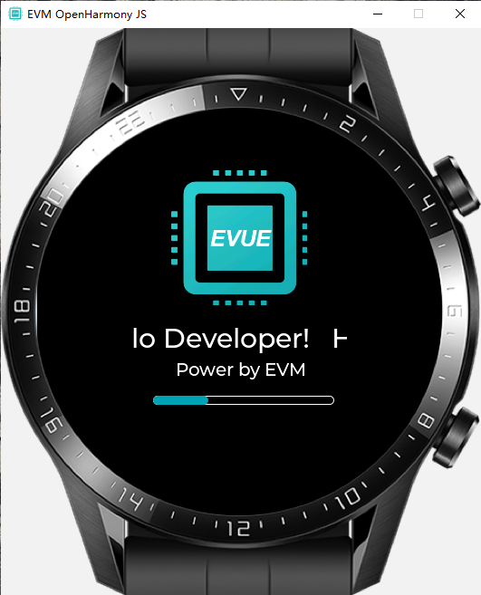

## 1. 下载模拟器，

[下载地址](https://github.com/scriptiot/evm/releases/download/v2.0/evuesimulator-windows-v2.0.zip)


## 2. 解压文件


## 3. 双击运行


## 4. 查看界面



## 5. 运行更多例子

+ 在终端运行更多的例子

```shell
    cd  evuesimulator-windows-v2.0
    ./evuesimulator.exe test/xxxx
```

+ 智能穿戴手表例子

```shell
    cd  evuesimulator-windows-v2.0
    ./evuesimulator.exe test/LiteWearable
```
