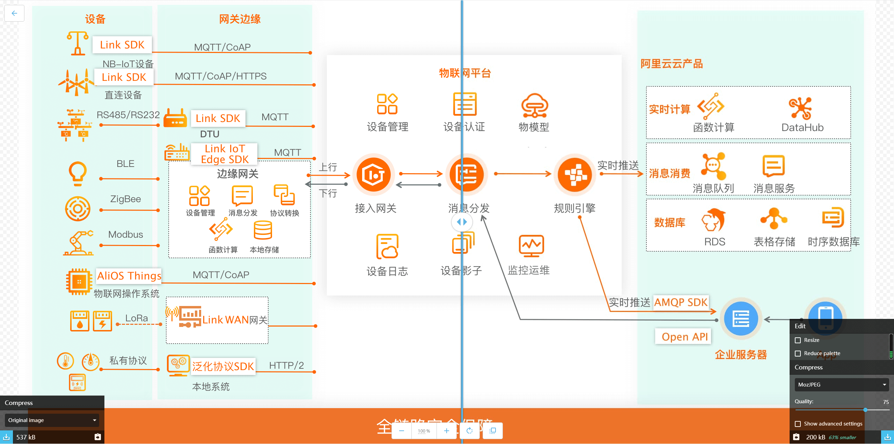
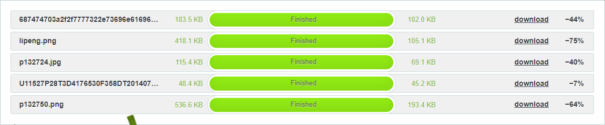
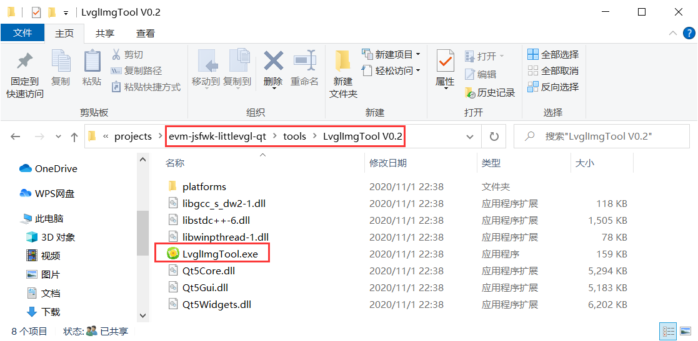
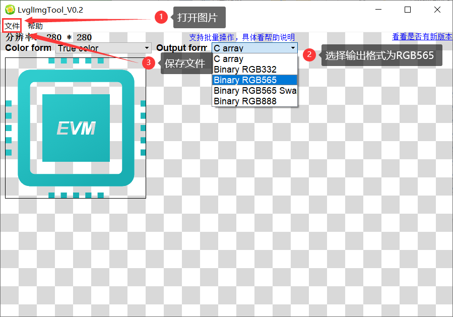

> 说明  
> 图片格式、尺寸、体积  
> 工具  

# 说明

本篇教程旨在说明如何处理图片，主要有一下几个方面：

* 目前evue只支持`.png`格式的图片，所以所有图片均需转换成`.png`格式；

* 受限于嵌入式硬件环境，我们需要优化图片的文件体积；
* 受限于嵌入式屏幕尺寸，我们需要设置好图片的`width`和`height`。因为图片`width`和`height`后续无法动态设置；
* 介绍处理上面三个问题的工具。

# 图片格式、尺寸、体积

## 格式和体积

鉴于嵌入式硬件资源有限，在PC上看上去不大的图片，在嵌入式的开发板的屏幕上却卡成PPT，因为图片、动画这类操作有大量运算和内存占用，因此需要对图片进行压缩处理。压缩的原则是既要保持清晰度，又要降低文件体积。

如谷歌出品这一款浏览器在线的，集图片压缩，尺寸调整和格式转换于一体的工具：`squoosh`，链接在工具章节。这款工具的优点是支持高度灵活配置，你要什么就自己调整什么参数，一点一点调整清晰度和尺寸，这个工作需要耐心。

但是太多的选择对于非专业人士而言往往不是最好选择，我们不关心该如何调整参数，我们只希望图片丢进去，计算机自动给出最高清晰度和最小文件体积图片。因此，我们也为大家准备了一款浏览器在线的图片压缩工具`tinypng`，该工具功能单一，仅仅提供图片压缩，免费账号一次性可批量上传20张图片，每张最大支持5MB，压缩完可批量下载，但是只支持`.png`和`.jpeg`格式。

## 尺寸

我们在`454×454px`模拟器屏幕上，应用ICON的width和height设置为`64×64px`；启动屏LOGO设置为`128×128px`；电话页面的头像尺寸为`150×150px`；二维码尺寸为`300×300px`。你可以根据实际屏幕大小，提前预估图片尺寸。

你可以在后文工具章节找到一个免费提供图标下载的网站。

# 工具

工欲善其事，必先利其器。

我们为开发者挑选了几款好用的图片处理工具，大部分是在线版，打开浏览器就能使用，免去安装，无需关心跨平台的问题。

## LVGL PNG图片转换工具

仓库里自带的第三方工具，目前只能在Windows中使用。当你在使用原生`.png`图片出现问题的时候，你可以尝试将`.png`图片转换成`.bin`文件。

> 虽然EVM不提倡开发者将图片转换成`.bin`使用，但是还是需要说明一下，可以这么做，可以帮助开发者在一款新的开发板调试图片带来的问题以及性能评估。

工具在项目根目录`tools`文件夹。

双击`LvglImgTool.exe`	运行，你将看到如下界面：

按照图中标识步骤操作即可。

## 图片裁剪、尺寸调整

* https://www.gaoding.com/image 在线图片编辑

## 在线PhotoShop

* https://ps.gaoding.com/#/

## 图片压缩

高分辨率，低体积的图片如何处理？

下面工具都是`tinypng`，`.com`域名是国际站点，`.cn`是国内站点。访问速度和处理速度都差不多，只是中文界面看上去更有亲切感。

* https://tinypng.com

* https://tinify.cn/

谷歌出品的在线图片处理工具，初次加载速度比`tinypng`慢。

* https://squoosh.app

## 图标下载

阿里巴巴出品的图标网站

* https://www.iconfont.cn/ 